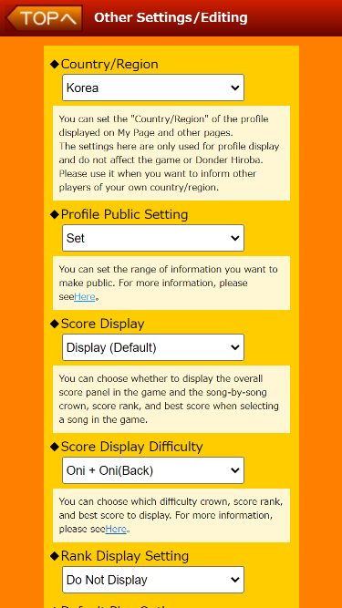

# Donder Hiroba Plus
[한국어](/README_ko.md)

A Chrome extension that adds useful features to the site [Donder Hiroba](https://donderhiroba.jp/index.php), which allows you to check your information in the game "Taiko no Tatsujin".

Song data are provided by [Team LAGOS](https://twitter.com/KOREA_TAIKO), Thanks!

## Installation

[>> Download from the Chrome Web Store <<](https://chromewebstore.google.com/detail/donder-hiroba-plus/dmendcaacmlddhgalacgccejbamnncci)

- Supported browsers: [Chrome](https://www.google.com/chrome/), [Naver Whale](https://whale.naver.com/ko/), [Kiwi Browser (mobile)](https://play.google.com/store/apps/details?id=com.kiwibrowser.browser&hl=en&gl=US&pli=1)

## Features
|  |  |
|:------------------------:|:------------:|
| [Popup Window](#popup-window) | [Rating System](#rating-system) |

 | 
|:--------------------------------:|:-------------------------------------:|
| [Playlist](#playlist) | [Detailed Song Search](#detailed-song-search) |

 | 
|:--------------------------------:|:-------------------------------------:|
| [Translation](#translation) | [Integration with Taikowiki Difficulty Chart](#integration-with-taikowiki-difficulty-chart) |

## Usage
### Popup Window
After installation, click the extension icon to open the popup window.

Once the popup window is open, log in to Donder Hiroba so that the extension can access your user information.

- Click the Profile tab to view your user information and buttons to navigate to frequently used pages.
- Click the Settings tab, then click "Update Song Scores" to parse the score page and store the data in local storage.

### Rating System
Once you parsed the scores, the extension calculates ratings based on the parsed scores.

- Click the List tab to see your Donforce rating and the top 50 songs that contributed to your Donforce calculation.
- Click the Table tab to see the Donforce values you can earn by playing specific difficulty songs.
- Donforce formula: 6.0 * 1.3^(level - 6.0) * (badge) * (crown)
- Badge: Incomplete 0.0 / 0.5 / 0.6 / 0.7 / 0.8 / 0.9 / 0.95 / 1.0
- Crown: Incomplete 0.0 / Clear 0.85 / Full Combo 1.0 / Donder Full Combo 1.1
- For each difficulty played, Donforce is calculated, and your Donforce rating is the average of the top 50 Donforce values.
- Ratings are calculated per difficulty. You can select the difficulty for which you want to see the rating in the settings.
- The rating calculation formula and levels may change in the future.
- Ratings do not accurately reflect your skill. Please treat them as just for fun!

### Detailed Song Search

When visiting the [Score Page](https://donderhiroba.jp/score_list.php), you'll see an additional "Advanced Search Options" button.

- Text - Filter by matching song titles and artists
- Difficulty - Select the difficulty to apply the filters below
- Sort - Sort songs (by difficulty, song title, song length, max BPM)
- Crown - Filter by Clear / Full Combo / Donder Full Combo
- Badge - Filter by song score badge
- Level - Filter by difficulty range

Click the icon in the top right corner of a song to see detailed information and direct links to YouTube, WikiWiki, and Korean Taikowiki.

### Integration with Korean Taikowiki Difficulty Chart

After 'Song Score Update' in the setting, visit the [Taikowiki Difficulty Chart](https://taiko.wiki/diffchart/clear/10) to see song backgrounds colored based on crown status, and badges displayed in the top right corner.

### Translation
- Some UI texts are translated into English when the language is set to English.
- Translation may not be perfect since it is done by machine translation + my poor English skills. Please let me know if there are any errors.

### Playlist

- On the score page, click the list button in the top left corner of a song to see the current playlist and an "Create New Playlist" button.
- Click the Export button to register the created playlist as a "Favorite Songs" list, allowing you to quickly find songs in the arcade.
- Click the Copy Base64 button to copy the playlist to your clipboard, which can be shared with other users. Alternatively, click the Decode Base64 button and paste the copied Base64 to restore the playlist.
- Click the Import button to create a playlist from your current "Favorite Songs" list.

## Contributing

Any form of contribution is welcome, including ideas, bug reports, translations, and code contributions!

Share your thoughts on [Discussions](https://github.com/exqt/donder-hiroba-plus/discussions) or submit bug reports on [Issues](https://github.com/exqt/donder-hiroba-plus/issues).
