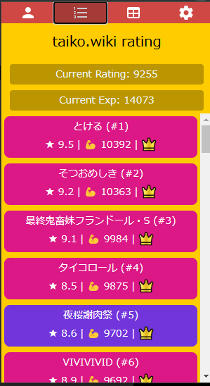

# Donder Hiroba Plus
[한국어 설명서](/README_ko.md)

A Chrome extension that adds useful features to the site [Donder Hiroba](https://donderhiroba.jp/index.php), which allows you to check your information in the game "Taiko no Tatsujin".

Song data are provided by [taiko.wiki](https://taiko.wiki), Thanks!

## Installation

[>> Download from the Chrome Web Store <<](https://chromewebstore.google.com/detail/donder-hiroba-plus/dmendcaacmlddhgalacgccejbamnncci)

- Supported browsers: [Chrome](https://www.google.com/chrome/), [Naver Whale](https://whale.naver.com/ko/), [Kiwi Browser (mobile)](https://play.google.com/store/apps/details?id=com.kiwibrowser.browser&hl=en&gl=US&pli=1), [Orion Browser by Kagi (iOS, Popup Only)](https://apps.apple.com/us/app/orion-browser-by-kagi/id1484498200)

## Features
|  |  |
|:------------------------:|:------------:|
| [Popup Window](#popup-window) | [taiko.wiki Rating System](#rating-system) |

 | 
|:--------------------------------:|:-------------------------------------:|
| [Playlist](#playlist) | [Detailed Song Search](#detailed-song-search) |

 | 
|:--------------------------------:|:-------------------------------------:|
| [Translation](#translation) | [Integration with Taikowiki Difficulty Chart](#integration-with-taikowiki-difficulty-chart) |

## Usage
- Click the extension icon to open the Popup Window
- Visit [donderhiroba.jp](https://donderhiroba.jp) to use the extention features

### Detailed Song Search
When visiting the [Score Page](https://donderhiroba.jp/score_list.php), you'll see an additional "Advanced Search Options" button.

- Text - Filter by matching song titles and artists
- Difficulty - Select the difficulty to apply the filters below
- Sort - Sort songs (by difficulty, song title, song length, max BPM)
- Crown - Filter by Clear / Full Combo / Donder Full Combo
- Badge - Filter by song score badge
- Level - Filter by difficulty range

Click the icon in the top right corner of a song to see detailed information and direct links to YouTube, WikiWiki, and Korean Taikowiki.

### Rating System
> [!NOTE]
> Donforce has been deprecated and replaced with taiko.wiki Rating System

> Go to Popup Window > Settings > taiko.wiki Rating Upload
and upload your data to see your rating.

See [taiko.wiki page](https://taiko.wiki/rating) for more details.

### Integration with taiko.wiki Difficulty Chart
> Go to Popup Window > Settings > taiko.wiki Rating Upload
and upload your data to see your colored diffchart.

- Track your Clear/Fullcombo/Donderfull Song in [taiko.wiki diffchart](https://taiko.wiki/diffchart/clear/10)
- You can also use [Playlist](#playlist) feature to create a playlist from the Taikowiki Difficulty Chart. (Right-click on the song to add it to the playlist)

### Translation
- Some UI texts are translated into English when the language is set to English.
- Translation may not be perfect since it is done by machine translation + my poor English skills. Please let me know if there are any errors.

### Playlist

- On the score page, click the list button in the top left corner of a song to see the current playlist and an "Create New Playlist" button.
- Click the Export button to register the created playlist as a "Favorite Songs" list, allowing you to quickly find songs in the arcade.
- Click the Copy Base64 button to copy the playlist to your clipboard, which can be shared with other users. Alternatively, click the Decode Base64 button and paste the copied Base64 to restore the playlist.
- Click the Import button to create a playlist from your current "Favorite Songs" list.

## Contributing

Any form of contribution is welcome, including ideas, bug reports, translations, and code contributions!

Share your thoughts on [Discussions](https://github.com/exqt/donder-hiroba-plus/discussions) or submit bug reports on [Issues](https://github.com/exqt/donder-hiroba-plus/issues).
