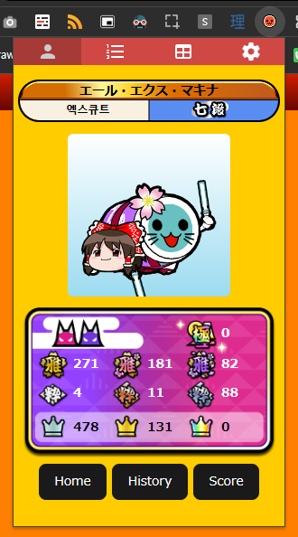
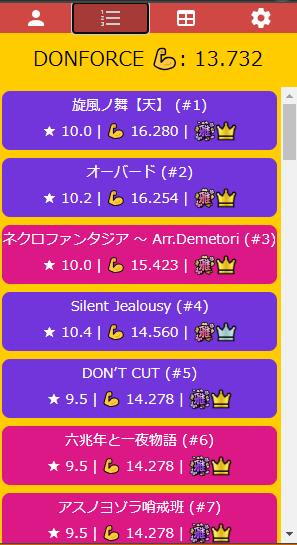
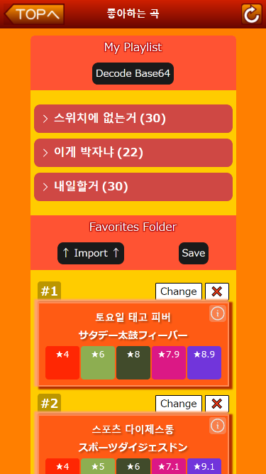
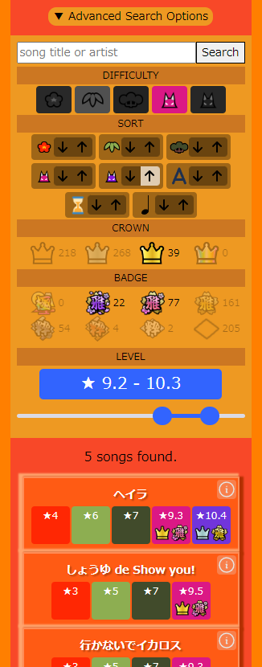
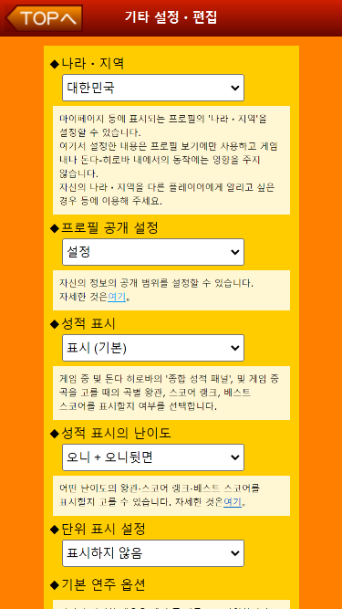
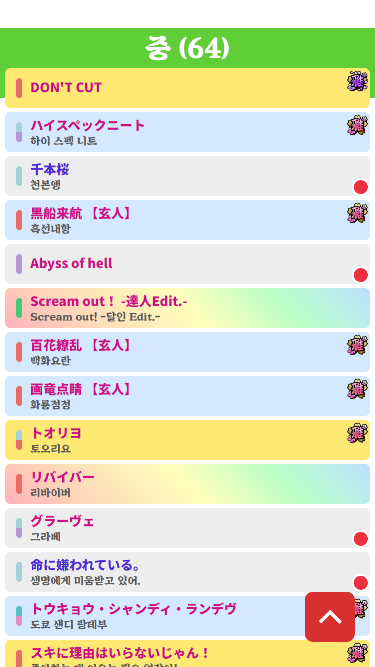

# 돈더 히로바 플러스

게임 "태고의 달인"에서 자신의 정보를 확인할 수 있는 사이트 [돈더 히로바](https://donderhiroba.jp/index.php) 에 유용한 기능들을 추가 시켜주는 크롬 확장 프로그램

곡 정보는 [Team LAGOS](https://twitter.com/KOREA_TAIKO)에서 제공해 주셨습니다. 감사합니다!

## 설치
[>> 크롬 웹 스토어에서 내려 받기 <<](https://chromewebstore.google.com/detail/donder-hiroba-plus/dmendcaacmlddhgalacgccejbamnncci)

- 지원 브라우저 : [크롬](https://www.google.com/chrome/), [네이버 웨일](https://whale.naver.com/ko/), [Kiwi Browser (모바일)](https://play.google.com/store/apps/details?id=com.kiwibrowser.browser&hl=en&gl=US&pli=1)

## 기능
|  |  |
|:------------------------:|:------------:|
| [팝업창](#팝업창) | [레이팅 시스템](#레이팅-시스템) |

 | 
|:--------------------------------:|:-------------------------------------:|
| [플레이리스트](#플레이리스트) | [상세 곡 검색](#상세-곡-검색) |

 | 
|:--------------------------------:|:-------------------------------------:|
| [번역](#번역) | [태고위키 서열표 연동](#태고위키-서열표-연동) |

## 사용법
### 팝업창
설치 후 크롬 확장 프로그램 아이콘을 클릭하면 팝업창이 열립니다.
팝업창이 열리면 우선 돈더 히로바에 로그인해서 확장 프로그램이 유저 정보를 확인할 수 있도록 합니다.

- 프로필 탭을 클릭하면 유저 정보를 확인할 수 있고 자주쓰는 페이지로 이동할 수 있는 버튼이 있습니다.
- 톱니바퀴 탭을 클릭하여 설정 탭으로 간 후 "곡 스코어 업데이트" 를 누르면 스코어 페이지를 파싱하여 로컬 저장소에 저장합니다.

### 레이팅 시스템
[팝업창](#팝업창)에서 파싱한 스코어를 기반으로 레이팅을 계산합니다.

- 리스트 탭을 클릭하면 레이팅인 Donforce와 Donforce 계산에 들어간 상위 50개의 곡을 확인할 수 있습니다.
- 테이블 탭을 클릭하면 특정 난이도 곡을 플레이 했을 때 얻을 수 있는 Donforce값을 확인할 수 있습니다.

- Donforce 공식 : 6.0 * 1.3^(level - 6.0) * (뱃지) * (왕관)
- 뱃지: 미클리어 0.0 / 0.5 / 0.6 / 0.7 / 0.8 / 0.9 / 0.95 / 1.0
- 왕관: 미클리어 0.0 / 클리어 0.85 / 풀 콤보 1.0 / 돈더풀 콤보 1.1
- 플레이한 난이도 마다 Donforce를 계산 후 상위 50개의 Donforce의 평균값이 플레이어의 Donforce가 됩니다.
- 레이팅은 난이도별로 계산됩니다. 설정에서 레이팅을 보고 싶은 난이도를 선택할 수 있습니다.
- 레이팅 산출 공식과 레벨은 차후 변경될 수 있습니다.
- 레이팅은 정확한 실력을 반영하지 않습니다. 재미로만 봐주세요!

### 상세 곡 검색
[스코어 페이지](https://donderhiroba.jp/score_list.php) 방문 시 "Advanced Search Options" 라는 버튼이 추가된 것을 확인할 수 있습니다.
- Text - 곡 제목, 아티스트와 매칭된 것을 필터링
- Difficulty - 아래에 사용되는 필터링을 어떤 난이도에 적용할지 선택
- Sort - 곡 정렬 (난이도, 곡 제목 정렬, 곡 길이, 최대 BPM)
- Crown - 미클리어 / 클리어 / 풀콤보 / 돈더풀콤보 필터링
- Badge - 뱃지(곡 점수) 필터링
- Level - 난이도 구간 설정 필터링

곡에서 오른쪽 상단에 있는 아이콘을 클릭하면 상세 정보 및 Youtube, WikiWiki, 태고 위키 바로가기 링크를 나옵니다.

### 태고위키 서열표 연동
[팝업창](#팝업창)에서 '곡 스코어 업데이트' 를 한 후 [태고 위키의 서열표](http://taikowiki.com/diffchart/clear/10/) 에 들어가면 왕관 기준으로 곡 마다 배경색이 바뀌고, 오른쪽 상단에 뱃지가 표시됩니다.

### 번역
- 설정에서 언어를 한국어로 설정 시 곡 제목이 유저 번역 제목으로 보입니다.
- 돈더 히로바 안의 UI도 번역됩니다.
- 번역기를 사용하여 번역이 완벽하지 않을 수 있습니다. 틀린 부분이 있으면 알려주세요.

### 플레이리스트
- 스코어 페이지에서 곡 왼쪽 상단에 리스트 버튼을 클릭하면 현재 플레이 리스트 목록과 추가할 수 있는 버튼이 보입니다.
- 만들어진 플레이리스트를 Export 버튼을 눌러 기존에 제공되는 좋아하는 곡 리스트로 등록하여 아케이드에서 빠르게 곡을 찾을 수 있습니다.
- Copy Base64 버튼을 클릭하여 클립보드에 복사하면 다른 사용자에게 공유할 수 있습니다. 마찬가지로 Decode Base64 버튼을 클릭하여 복사한 Base64를 붙여넣으면 플레이 리스트가 복원됩니다.
- Import 버튼을 누르면 현재 좋아하는 곡 리스트를 플레이 리스트로 만듭니다.

## 기여
아이디어 제안, 버그 리포트, 번역, 코드 기여 등 어떤 형태의 기여도 환영합니다!

[Discussions](https://github.com/exqt/donder-hiroba-plus/discussions) 에서 의견을 나누거나 [Issues](https://github.com/exqt/donder-hiroba-plus/issues) 에 버그 리포트를 남겨주세요.
